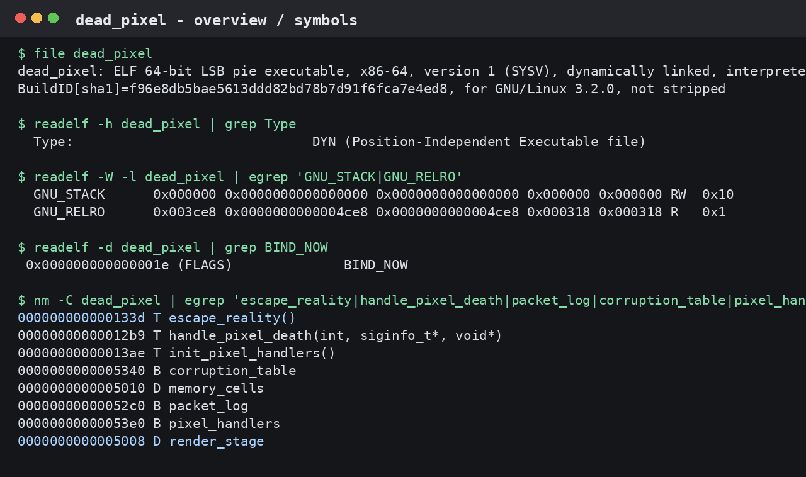
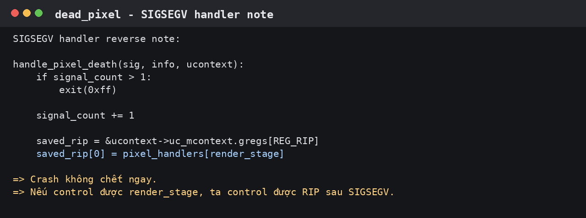
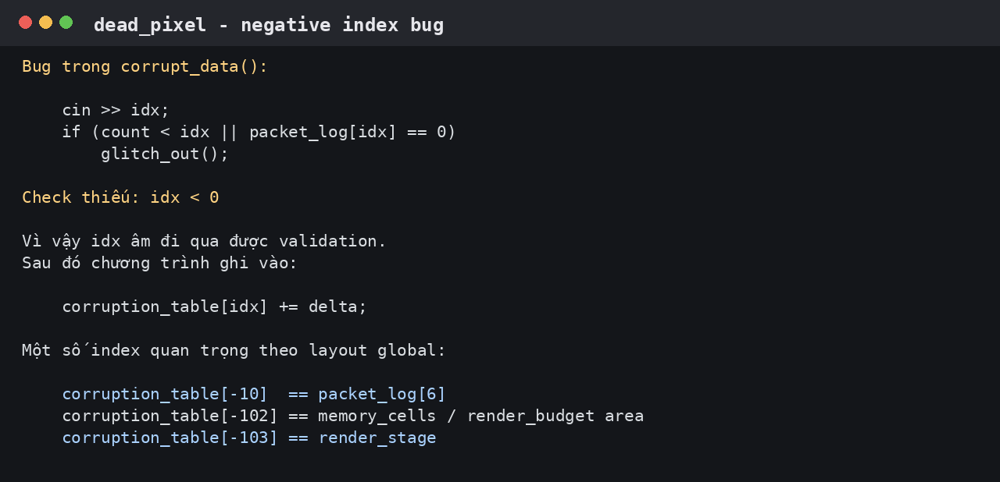
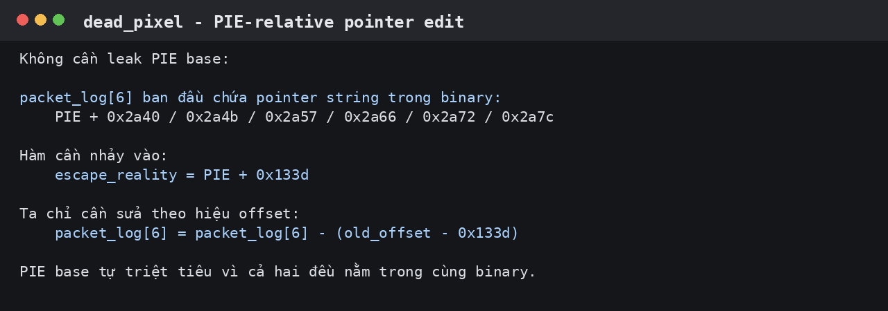
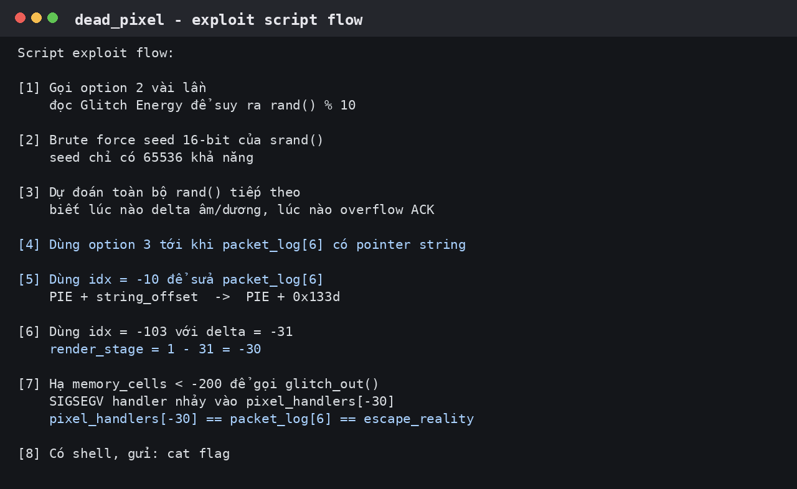
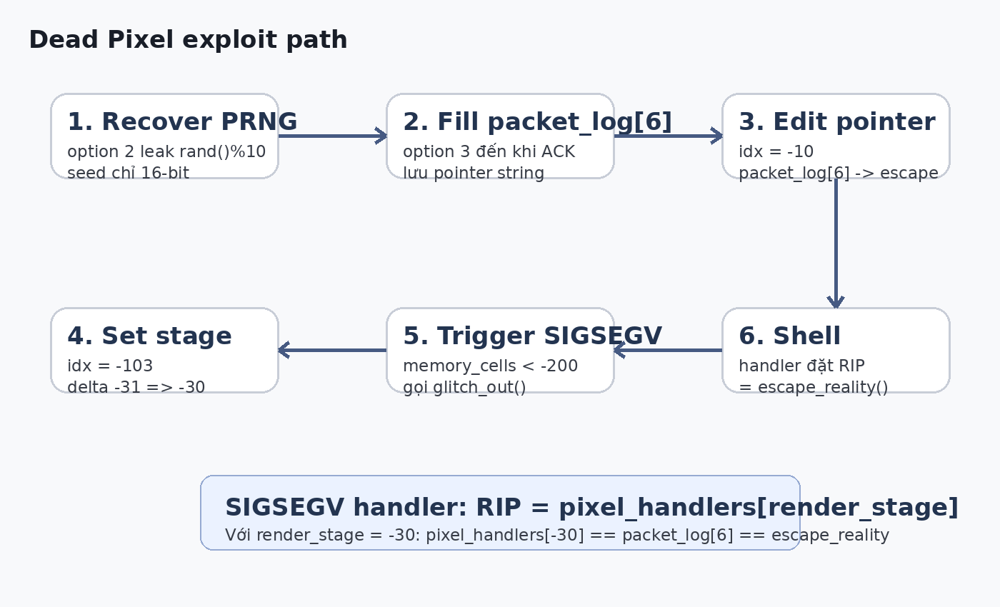

# Dead Pixel write-up

> Lỗi chính của bài là OOB bug: chương trình cho nhập index âm để ghi ra ngoài mảng, sau đó lợi dụng luôn `SIGSEGV handler` của binary để đổi hướng RIP vào hàm lấy shell.

## Tổng quan

Khi mở binary ra trước tiên mình kiểm tra nhanh bằng `file`, `readelf` và `nm`. Binary là ELF 64-bit, PIE bật, NX bật, và không bị strip nên symbol khá dễ nhìn.



Các symbol đáng chú ý:

```text
escape_reality()       @ 0x133d
handle_pixel_death()   @ 0x12b9
render_stage           @ 0x5008
memory_cells           @ 0x5010
packet_log             @ 0x52c0
corruption_table       @ 0x5340
pixel_handlers         @ 0x53e0
```

Mục tiêu là điều khiển rip cho program nhảy vào `escape_reality()`:

```c
void escape_reality() {
    system("/bin/sh");
    exit(0);
}
```

---

## 1. Cơ chế lạ của bài: crash nhưng không chết ngay

Điểm đầu tiên mình để ý là binary có custom handler cho `SIGSEGV`. Tức là khi chương trình segfault, nó không chết ngay như bình thường.



Logic handler có thể hiểu như sau:

```c
void handle_pixel_death(int sig, siginfo_t *info, void *ucontext) {
    if (signal_count > 1)
        exit(0xff);

    signal_count++;

    saved_rip = &ucontext->uc_mcontext.gregs[REG_RIP];
    *saved_rip = pixel_handlers[render_stage];
}
```

Khi crash, handler lấy `render_stage` làm index rồi set lại RIP thành:

```c
pixel_handlers[render_stage]
```

Vậy hướng khai thác bắt đầu rõ ràng hơn:

```text
control render_stage
-> làm pixel_handlers[render_stage] trỏ tới nơi mình muốn
-> cố tình gây SIGSEGV
-> handler sửa RIP
-> nhảy vào escape_reality()
```

---

## 2. Bug thứ nhất: nhập index âm trong `corrupt_data()`

Menu `CORRUPT DATA` cho mình nhập index packet. Đoạn check index bị sai:

```c
cin >> idx;

if (count < idx || packet_log[idx] == 0)
    glitch_out();
```

Bug ở đây là chương trình chỉ check `count < idx`, nhưng không check `idx < 0`.

Nếu nhập index âm, ví dụ `idx = -10`, điều kiện kiểu như:

```c
count < -10
```

sẽ sai, nên chương trình vẫn cho đi tiếp. Sau đó nó ghi vào:

```c
corruption_table[idx] += delta;
```

Vì `idx` âm, phép ghi này đi lùi ra trước mảng `corruption_table`, đụng sang các biến global khác.



Từ layout global, các index âm quan trọng là:

```text
corruption_table[-10]  == packet_log[6]
corruption_table[-102] == vùng memory_cells / render_budget
corruption_table[-103] == render_stage
```

Ba index này chính là ba “nút điều khiển” của exploit.

---

## 3. Bug thứ hai: `render_stage` không bị giới hạn

Trong handler, chương trình dùng trực tiếp:

```c
pixel_handlers[render_stage]
```

nhưng không có bounds check. Bình thường `render_stage` phải là số nhỏ hợp lệ, nhưng nếu mình sửa nó thành số âm thì handler sẽ đọc lùi ra trước mảng `pixel_handlers`.

Mục tiêu mình chọn là:

```text
render_stage = -30
```

Vì theo layout memory:

```text
pixel_handlers[-30] == packet_log[6]
```

Nếu mình set được:

```text
packet_log[6] = escape_reality
render_stage  = -30
```

thì khi crash:

```text
RIP = pixel_handlers[render_stage]
RIP = pixel_handlers[-30]
RIP = packet_log[6]
RIP = escape_reality
```

Vậy bug thứ hai biến một lỗi segfault thành primitive control-flow.

---

## 4. Không cần leak PIE

Binary có PIE on nên địa chỉ runtime của `escape_reality()` thay đổi mỗi lần chạy. Nhưng bài này có cách exploit mà không cần biết PIE base.

Trong option `OVERFLOW BUFFER`, nếu may mắn, chương trình lưu một pointer string trong binary vào `packet_log[packet_index]`. Các string này nằm ở những offset như:

```text
PIE + 0x2a40
PIE + 0x2a4b
PIE + 0x2a57
PIE + 0x2a66
PIE + 0x2a72
PIE + 0x2a7c
```

Còn `escape_reality()` nằm ở:

```text
PIE + 0x133d
```

Vậy nếu `packet_log[6]` ban đầu là pointer string, mình chỉ cần partial overwrite:

```text
PIE + old_offset  ->  PIE + 0x133d
```



Đây là lý do exploit không cần leak địa chỉ thật.

---

## 5. rand() bypass

Nhiều hành động trong game phụ thuộc vào `rand()`:

- option `EXPLOIT ENGINE` làm thay đổi `glitch_energy`
- option `OVERFLOW BUFFER` chỉ ghi log nếu `rand() % 10 == 0`
- option `CORRUPT DATA` cộng hoặc trừ một `delta` random vào memory

Lúc đầu nhìn có vẻ hên xui, nhưng seed của `srand()` chỉ có 2 byte từ `/dev/urandom`, tức là chỉ có `65536` khả năng.

Script lợi dụng option 2 để leak chuỗi `rand() % 10`.

Ví dụ, ban đầu:

```text
Glitch Energy = 500
```

Sau khi gọi option 2, nếu còn:

```text
Glitch Energy = 493
```

thì biết lần `rand()` đó có:

```text
rand() % 10 = 7
```

Lặp vài lần là có đủ output để brute force seed 16-bit. Sau khi biết seed, script tự sinh lại toàn bộ chuỗi `rand()` giống chương trình, từ đó biết trước lúc nào nên gọi option nào.

---

## 6. Làm sao script dựng được `packet_log[6]`

Option `OVERFLOW BUFFER` chỉ ghi vào `packet_log` nếu điều kiện này đúng:

```c
rand() % 10 == 0
```

Khi đúng, chương trình ghi một pointer string vào `packet_log[packet_index]`, rồi tăng `packet_index`.

Script đã biết PRNG rồi, nên nó cứ gọi option 3 cho tới khi có đủ 7 lần ACK. Lần ACK thứ 7 sẽ ghi vào:

```text
packet_log[6]
```

Đồng thời, vì script biết output `rand()` tiếp theo, nó cũng biết chính xác string nào được chọn, tức là biết `old_offset` của pointer trong `packet_log[6]`.

Ví dụ nếu pointer được chọn là:

```text
packet_log[6] = PIE + 0x2a72
```

thì cần sửa nó thành:

```text
packet_log[6] = PIE + 0x133d
```

---

## 7. Sửa `packet_log[6]` thành `escape_reality()`

Để sửa `packet_log[6]`, script dùng bug index âm:

```text
idx = -10
```

Vì:

```text
corruption_table[-10] == packet_log[6]
```

Mỗi lần gọi `CORRUPT DATA`, chương trình sẽ cộng hoặc trừ một delta vào ô nhớ đó. Script không ghi được 8 byte tùy ý ngay lập tức, nhưng do đã biết PRNG nên có thể chọn đúng thời điểm delta âm phù hợp.

Nói dễ hiểu hơn, script làm kiểu này:

```text
1. Tính cần trừ bao nhiêu để pointer string thành escape_reality.
2. Nhìn trước chuỗi rand() để tìm các delta âm có tổng đúng bằng số cần trừ.
3. Các lượt không cần thì gọi option 2 để “đốt rand”.
4. Đến lượt delta đẹp thì gọi CORRUPT DATA với idx = -10.
```

Kết quả cuối cùng:

```text
packet_log[6] = PIE + 0x133d = escape_reality()
```

---

## 8. Giữ chương trình không crash quá sớm

Trong `run_game()`, chương trình có check:

```c
if (memory_cells < -200)
    glitch_out();
```

`glitch_out()` sẽ gây segfault. Đây là thứ mình cần ở cuối exploit, nhưng nếu nó xảy ra quá sớm thì payload chưa chuẩn bị xong và chương trình chết.

Vì vậy script dùng thêm index:

```text
idx = -102
```

để điều chỉnh vùng `memory_cells`. Giai đoạn đầu script boost `memory_cells` lên cao để có đủ khoảng an toàn trong lúc sửa pointer.

Sau khi `packet_log[6]` đã trỏ tới `escape_reality()`, script mới tính cách hạ `memory_cells` xuống gần ngưỡng `-200`, chuẩn bị cho cú trigger cuối.

---

## 9. Set `render_stage = -30`

Mỗi lần vào `corrupt_data()`, chương trình set lại:

```c
render_stage = 1;
```

Muốn nó thành `-30`, cần một delta:

```text
-31
```

Vì:

```text
1 - 31 = -30
```

Script tìm trong chuỗi PRNG một thời điểm mà delta đúng bằng `-31`. Đến đúng lượt đó, nó gọi:

```text
CORRUPT DATA
idx = -103
```

Do:

```text
corruption_table[-103] == render_stage
```

nên sau lệnh này:

```text
render_stage = -30
```

---

## 10. Trigger cuối để lấy shell

Sau khi mọi thứ đã sẵn sàng:

```text
packet_log[6] = escape_reality()
render_stage  = -30
memory_cells  chuẩn bị tụt xuống dưới -200
```

script cho chương trình đi vào trạng thái crash bằng cách làm:

```text
memory_cells < -200
```

`run_game()` gọi `glitch_out()`, tạo `SIGSEGV`. Handler chạy và sửa RIP:

```text
RIP = pixel_handlers[render_stage]
RIP = pixel_handlers[-30]
RIP = packet_log[6]
RIP = escape_reality()
```

Lúc này chương trình gọi:

```c
system("/bin/sh");
```

Script chỉ cần gửi:

```bash
cat flag
```

là lấy được flag.

---

## 11. Flow script nhìn tổng thể

Ảnh dưới là flow đầy đủ của exploit script:



Có thể tóm tắt ngắn gọn như sau:

```text
leak rand()%10 qua Glitch Energy
-> brute force seed 16-bit
-> predict toàn bộ rand()
-> dùng option 3 để fill packet_log[6]
-> dùng idx -10 sửa packet_log[6] thành escape_reality
-> dùng idx -102 giữ memory_cells không crash sớm
-> dùng idx -103 set render_stage = -30
-> ép memory_cells < -200 để gọi glitch_out()
-> SIGSEGV handler nhảy vào escape_reality
-> shell
-> cat flag
```



---

## 12. Tổng kết

Flow exploit:

```text
negative index write
-> sửa global pointer
-> sửa render_stage âm
-> trigger SIGSEGV
-> handler đổi RIP
-> escape_reality()
```

Các bug chính:

```text
1. corrupt_data() không check idx < 0.
2. corruption_table[idx] cho phép ghi OOB vào global memory.
3. SIGSEGV handler dùng render_stage làm index nhưng không check bounds.
4. PRNG seed chỉ 16-bit nên có thể recover.
```

